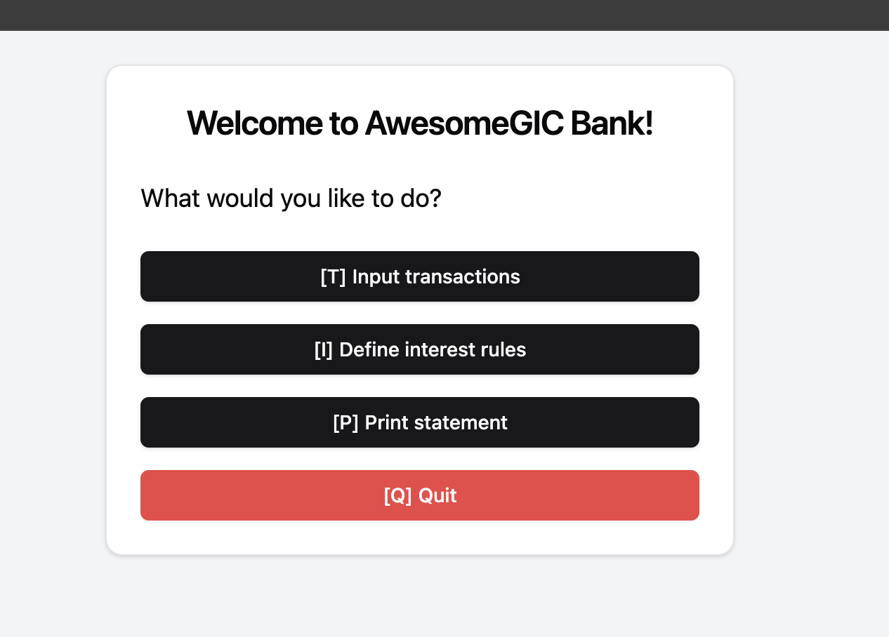

# 🏦 MERN Banking System

This is a **full-stack banking system prototype** built using the **MERN stack** (MongoDB, Express.js, React.js, and Node.js). It allows users to input transactions, define interest rates, and print statements.

## 🛠️ Tech Stack

- **Frontend**: React.js, Tailwind CSS, Shadcn.js,
- **Backend**: Node.js, Express.js, MongoDB (Mongoose)
- **Database**: MongoDB (Atlas or Local)
- **API Testing**: Postman

## 🚀 Installation & Setup

### 1️⃣ Clone the Repository

```sh
git clone https://github.com/YOUR_USERNAME/banking-system.git
cd banking-system
```

### 2️⃣ Install Backend Dependencies

```sh
cd backend
npm install
```

### 3️⃣ Set Up Environment Variables for Backend

Create a `.env` file inside the **backend** folder and add:

```env
PORT=8000
MONGODB_URI="Please use yours"
CORS_ORIGIN=*
```

### 4️⃣ Start the Backend Server

I have defined port as 8000, so server will start at http://localhost:8000

```sh
npm run dev
```

### 5️⃣ Install Frontend Dependencies

```sh
cd ../frontend
npm install
```

### 6️⃣ Start the Frontend

```sh
npm run dev
```

The frontend will run on **http://localhost:5173/**, and the backend on **http://localhost:8000/**.

## 📝 API Endpoints

### **Transactions**

- `POST /api/transactions/addTransaction` – Add a new transaction
- `GET /api/transactions` – Get all transactions
- `GET /api/transactions/getMonthlyTransactions` – Get monthly transactions by account

## 📸 Screenshots

Main Menu

Coming soon... 📸

## 🤝 Contributing

Pull requests are welcome! Follow these steps:

1. Fork the repo
2. Create a new branch (`git checkout -b feature-name`)
3. Commit your changes (`git commit -m "Added feature X"`)
4. Push to your branch (`git push origin feature-name`)
5. Open a pull request

## 📚 License

This project is licensed under the **MIT License**.

---

🔹 **Happy Coding!** 🎉
