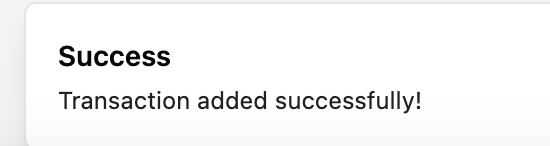

# 🏦 MERN Banking System


A full-stack banking system prototype with transaction management, interest rules, and statement generation capabilities.

## 📋 Table of Contents

- [Tech Stack](#-tech-stack)
- [Features](#-features)
- [Installation](#-installation)
- [API Endpoints](#-api-endpoints)
- [Frontend Structure](#-frontend-structure)
- [Validation & Error Handling](#-validation--error-handling)
- [Screenshots](#-screenshots)
- [Contributing](#-contributing)
- [License](#-license)

## 🛠️ Tech Stack

### **Frontend**

- React.js + TypeScript
- Vite (Build Tool)
- Tailwind CSS + Shadcn.js (UI Components)
- React Toastify (Notifications)

### **Backend**

- Node.js + Express.js
- MongoDB + Mongoose (ODM)
- API Testing: Postman

### **Database**

- MongoDB Atlas (Cloud) / Local Instance

## 🌟 Features

- Transaction management (Deposit/Withdrawal)
- Interest rule configuration
- Account statement generation
- Comprehensive input validation
- Real-time balance calculation
- User-friendly UI with toast notifications
- Error handling with user-friendly messages

## 🚀 Installation

### **Prerequisites**

- Node.js (v18+)
- MongoDB (Atlas URI or local instance)
- Git

### **Setup Instructions**

1. Clone the repository:

```bash
git clone https://github.com/YOUR_USERNAME/banking-system.git
cd banking-system
```

2. Backend Setup:

```bash
cd backend
npm install
```

3. Create `.env` file:

```bash
PORT=8000
MONGODB_URI="your_mongodb_uri"
CORS_ORIGIN=*
```

4. Start backend:

```bash
npm run dev
```

5. Frontend Setup:

```bash
cd ../frontend
npm install
```

6. Start frontend:

```bash
npm run dev
```

## 📡 API Endpoints

### **Transactions**

| Method | Endpoint                       | Description              |
| ------ | ------------------------------ | ------------------------ |
| POST   | `/api/v1/transactions`         | Create new transaction   |
| GET    | `/api/v1/transactions`         | Get all transactions     |
| GET    | `/api/v1/transactions/monthly` | Get monthly transactions |

### **Interest Rules**

| Method | Endpoint                 | Description              |
| ------ | ------------------------ | ------------------------ |
| POST   | `/api/v1/interest-rules` | Define new interest rule |
| GET    | `/api/v1/interest-rules` | Get all interest rules   |

## 🖥️ Frontend Structure

### **Core Components**

- **MainMenu** (`src/components/MainMenu/index.tsx`): Primary navigation interface
- **TransactionInput** (`src/components/TransactionInput/index.tsx`): Transaction creation form
- **InterestRules** (`src/components/InterestRules/index.tsx`): Interest rule management
- **AccountStatement** (`src/components/AccountStatement/index.tsx`): Statement generation UI
- **Quit** (`src/components/Quit/index.tsx`): Application exit handler

### **Key Features**

- Hot Module Replacement (HMR)
- Type-safe React components
- Responsive UI with Tailwind CSS
- Form validation with error highlighting
- Success/error toast notifications

## 🛡️ Validation & Error Handling

### **Date Validations:**

- Future date prevention
- Transaction sequence enforcement
- YYYYMMDD format validation

### **Financial Checks:**

- Initial withdrawal prevention
- Insufficient funds validation

### **System Feedback:**

- Inline form error messages
- Toast notifications for success/errors
- Clear API error responses

### **Data Integrity:**

- Transaction date > first transaction
- Unique transaction ID generation
- Interest rule validation

Some screenshots:
MainMenu


Input Transaction


Print Statement


Validarions and Toast Messages




## 📄 License

This project is licensed under the MIT License - see the LICENSE file for details.

---

The frontend will be accessible at `http://localhost:5173` by default (Vite's default port), while the backend runs on `http://localhost:8000` as specified.
